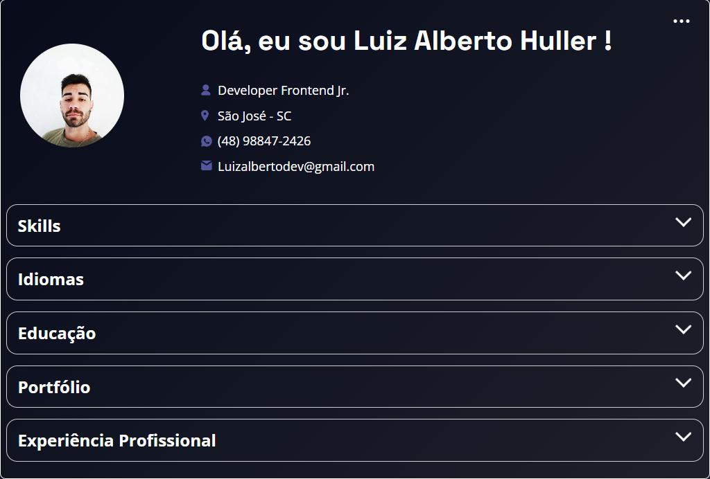

# 💼 Portfólio Web - Desenvolvedor Front-end Júnior

🌐 **Acesse o projeto:**
https://SEU-LINK-AQUI

---

Este é o meu projeto de portfólio pessoal desenvolvido para apresentar minhas habilidades em desenvolvimento front-end e meus projetos.

---

## 🚀 Tecnologias utilizadas

* HTML5
* CSS3
* JavaScript
* Git e GitHub

---

## 📸 Preview do projeto

---

## 📂 Funcionalidades

* Exibição de informações pessoais
* Lista de habilidades (Hard Skills e Soft Skills)
* Portfólio de projetos
* Experiência profissional
* Consumo de dados via JSON
* Layout responsivo

---

## 🧠 O que eu aprendi com este projeto

* Estruturação de páginas com HTML
* Estilização com CSS
* Manipulação de dados com JavaScript
* Consumo de API / JSON
* Organização de código
* Versionamento com Git

---

## 📌 Próximas melhorias

* Adicionar novos projetos
* Melhorar o design e responsividade
* Implementar animações
* Integrar com APIs
* Migrar para React futuramente

---

## 👨‍💻 Autor

**Luiz Alberto Huller da Silva**

* GitHub: https://github.com/LuizAlbertoDev
* LinkedIn: https://linkedin.com/in/luizalbertodev
* Email: [luizalbertodev@gmail.com](mailto:luizalbertodev@gmail.com)

---

## 📄 Licença

Este projeto foi desenvolvido para fins de estudo e portfólio pessoal.

---

## 🚀 Tecnologias

